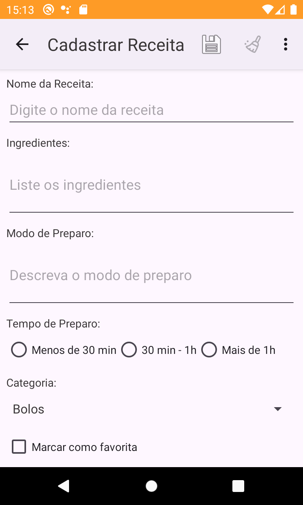
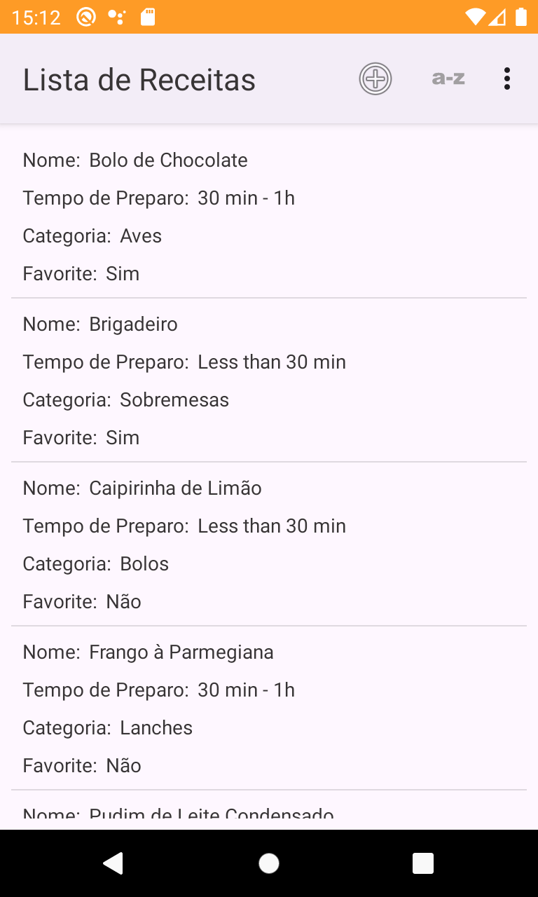

<h1 align="center">
  
   Receitix 
</h1>

<h4 align="center">📱Aplicativo Android em Java para cadastro e gerenciamento de receitas de forma simples e intuitiva.</h4>

  
  
  

	
	

## Funcionalidades

- Cadastro, exibição, edição e exclusão de receitas
- Organização das receitas por ordem alfabética
- Modo noturno para uma navegação confortável
- Armazenamento local das receitas
- Interface responsiva para diferentes tamanhos de tela
- Suporte aos idiomas português, inglês e espanhol

## Compilando a Partir do Código-Fonte

Se você deseja contribuir com o **Receitix** ou começar a utilizá-lo, primeiro [familiarize-se com o desenvolvimento Android](https://developer.android.com/training/basics/firstapp/index.html) e [configure um ambiente de desenvolvimento](https://developer.android.com/sdk/index.html).

O próximo passo é clonar o repositório do código-fonte:

    $ git clone https://github.com/WadyJorge/receitix.git

Caso prefira não usar uma IDE como o Android Studio, você pode compilar o **Receitix** diretamente pela linha de comando:

    $ cd Receitix
    $ ./gradlew assembleRelease

## Licença

Este programa é um software livre, o que significa que você tem liberdade para usá-lo, estudá-lo, compartilhá-lo e aprimorá-lo conforme desejar. Você pode redistribuí-lo e/ou modificá-lo de acordo com os termos da [Licença Pública Geral GNU](https://www.gnu.org/licenses/gpl.html), conforme publicada pela Free Software Foundation, seja na versão 3 ou em qualquer versão posterior da Licença, conforme sua escolha.

&nbsp;
&nbsp;

Copyright (C) 2025 Wady Jorge. Todos os direitos reservados.
